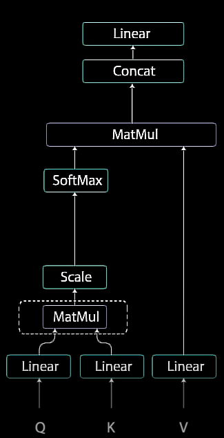
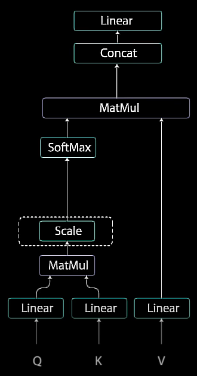
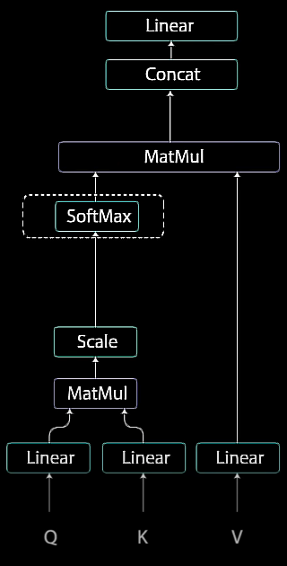

# Transformer Neural Network

>Um modelo transformer é uma rede neural que aprende o contexto e, assim, o significado com o monitoramento de relações em dados sequenciais como as palavras desta frase.
>
> -- Rick Merritt, Staff Writer da Nvidia

As redes neurais convolucionais (CNNs – Convolutional Neural Networks) e as redes neurais recorrentes (RNNs – Recurrent Neural Networks), os tipos de modelos de deep learning que eram mais populares foram revolucionadas pela arquitetura Transformer.

O marco foi introduzido pelo artigo [“Attention Is All You Need”](https://arxiv.org/pdf/1706.03762) em 2017, onde oito cientistas da Google introduziram tal arquitetura de deep learning.
Desde então, a arquitetura Transformer se tornou a preferida para modelos de [[Deep Learning]], sendo a base de modelos generativos de texto como o **GPT** da OpenAI, o **Llama** da Meta, e o **Gemini** da Google.

-----
## Diagrama

-----
### Input Embedding

A primeira etapa é alimentar o input em uma *word embedded layer*.
Uma *word embedded layer* pode ser imaginada como uma tabela de pesquisa para alcançar uma representação de fator de aprendizado de cada palavra.

Redes neurais aprendem por meio de números, então cada palavra é mapeada em vetores com valores contínuos para representar essa palavra.

Digamos que você queria gerar texto utilizando um modelo Transformer, neste exemplo o GPT-2. Você adiciona o prompt como esse: ``“Data visualization empowers users to”``. Esse input precisa ser convertido em um formato do qual o modelo possa entender e processar. Aqui é onde o *embedding* entra: ele transforma o texto em uma representação numérica com a qual modelo possa trabalhar.
Para converter um prompt em *embedding*, é necessário:

1. *Tokenizar* o input, - [[#Tokenização]]
2. obter os *embeddings* dos tokens, - [[#Token Embedding]]
3. adicionar informação posicional, e finalmente - [[#Positional Encoding]]
4. somar o token e a codificação posicional para receber o *embedding* final.  

##### Tokenização

*Tokenização* (Tokenization) é o processo de quebrar o input em pedaços menores, pedaços mais maleáveis chamados **tokens**.
Esses tokens podem ser uma palavra ou uma subpalavra. As palavras `Data` e `visualization` correspondem a tokens únicos, enquanto a palavra `empowers` é dividida em dois tokens. O vocabulário completo de tokens é decidido antes de treinar o modelo - O vocabulário do GPT-2 possui 50.257 tokens únicos.

Agora que dividimos nosso input em tokens com IDs distintos, podemos obter suas representações em vetores por *embeddings*.

##### Token Embedding

GPT-2 Small representa cada token no vocabulário como um vetor de 768 dimensões. A dimensão do vetor depende diretamente do modelo.

Esses vetores de *embedding* são armazenados em uma matriz de formato (50.257, 768), contendo aproximadamente **39 milhões de parâmetros**. Essa matriz extensiva permite o modelo assimilar significado semântico a cada token.

-----
#### Positional Encoding

A próxima etapa é injetar informações posicionais nos *embeddings*, pois um encoder transformer não possui recorrência como outras redes neurais recorrentes conhecidas.
É necessário adicionar informações sobre as posições nos *input embeddings*, e isso é feito utilizando positional encoding (codificação posicional).

Os autores do artigo utilizaram funções seno e cosseno a codificação posicional, onde para cada time step ímpar é criado um vetor utilizando a função cosseno, e para cada time step par é criado um vetor utilizando a função seno.
Esses vetores são então adicionados para seus *embedding vectors* correspondentes.

As funções seno e cosseno foram escolhidas em conjunto pois elas possuem propriedades lineares que o modelo pode facilmente aprender a tratar.

-----
### Encoder Layer (Transformer Block)

O trabalho da *encoder layer* é mapear toda a sequência de entrada de dados (*input sequence*) em uma representação abstrata contínua que contém a informação aprendida para essa sequência inteira.

Ela contém dois submódulos: **Multi-Headed Attention seguido por uma rede completamente conectada**. 
Também existem conexões residuais em volta de cada um dos dois submódulos, seguidas por uma normalização de camadas (*layer normalization*).

#### Multi-Headed Attention

Multi-Headed Attention e o encoder aplicam um mecanismo de atenção específico chamado **Self-Attention**.

Self-Attention permite o modelo associar cada palavra individual no input com outras palavras no input.

-----

Neste exemplo, é possível que o modelo possa aprender a associar a palavra **you** com **how** e **are**.

Também é possível que o modelo aprenda que as palavras estruturadas nesse padrão são tipicamente uma questão, respondendo apropriadamente.

##### Self-Attention

Para alcançar Self-Attention alimenta-se o input em três camadas distintas totalmente conectadas para criar os vetores de **query**, **key** e **value**.

Cada vetor de *embedding* de cada token é transformado nesses três vetores de **query(Q)**, **key(K)** e **value(V)**. 
Esses vetores são derivados ao multiplicar a matriz de *embedding* do input com as matrizes de pesos aprendidas para Q, K e V.

###### Queries, Keys & Values

>Os conceitos de query/key/value vêm de *retrieval systems*. Por exemplo, quando você escreve uma *query* para buscar por alguns vídeos no YouTube, o mecanismo de busca irá mapear sua *query* contra um set de *keys* (título do vídeo, descrição, etc.) associadas com vídeos candidatos no banco de dados, e então lhe apresentar os vídeos mais compatíveis (*values*). 

 - **Query (Q)** é texto que você escreve em uma barra de pesquisa de um mecanismo de busca. Esse é o token que você deseja “encontrar mais informações sobre”.
 - **Key (K)** é o título de cada página da web na janela de resultados da busca. Ela representa os possíveis tokens dos quais a query pode atender.
 - **Value (V)** é o atual conteúdo das páginas da web exibidas. Assim que os termos de pesquisa (query) com os resultados relevantes (key) foram apropriadamente assimilados, nós queremos obter o conteúdo (value) das páginas mais relevantes.

Utilizando desses valores *query*, *key* e *value*, o modelo pode calcular as matrizes de attention scores, que determinam o quanto de foco cada token deve receber quando gerando predições.

###### MatMul

As *queries* e *keys* passam por uma multiplicação de matrizes (Matrix - Mat, Multiplication - Mul) para produzir uma matriz quadrada de pontuação (*score matrix*).

A *score matrix* determina o quanto de foco uma palavra deve colocar em outras palavras, então cada palavra irá possuir um score que corresponde a outras palavras no time step. Quanto maior o score, maior o foco. É assim que as *queries* são mapeadas para *keys*.

![[MatMul Results.png]]
###### Scale

E então os scores são reduzidos de escala por serem divididos pela raiz quadrada da dimensão das *queries* e *keys*.
Isso serve para permitir gradientes mais estáveis, onde a multiplicação de valores pode ter efeitos explosivos.

###### SoftMax

Em seguida utilizam-se os Scaled Scores em uma função Softmax para receber os *attention weights*, que dão valores de probabilidade entre zero e um.

Utilizando Softmax, os maiores scores são aumentados, e os menores reduzidos. Isso permite o modelo ser mais confiante em qual palavra escolher.

###### MatMul

Então multiplicam-se os *Attention Weights* pelo vetor *value* para receber um vetor de *output*.
Os maiores scores da Softmax vão manter os valores das palavras que o modelo aprende como mais importantes. Os menores scores serão tratadas como palavras irrelevantes.

O output gerado alimenta uma camada linear para processá-lo. 

------

Para tornar isso uma computação Multi-Headed Attention, é necessário dividir a *query*, *key* e *value* em *N* vetores antes de aplicar *Self-Attention*.

Para dividir os vetores isso passa pelo mesmo processo de Self-Attention individualmente. Cada processo de Self-Attention é chamado de uma *head*.

Cada *head* produz um vetor de output que é concatenado em um vetor unitário antes de ir para uma camada linear final.

Em teoria, cada *head* iria aprender algo diferente, o que traria ao modelo de encoder um maior poder de representação.

-----

Em síntese, Multi-Headed Attention é um módulo em uma transformer network que computa a os *attention weights* para o input e produz um vetor de output com informação codificada em como cada palavra deveria tratar todas as outras palavras em uma sequência.

Em seguida, o vetor do output da Multi-Headed Attention é adicionado ao input original. Isso é chamado de **conexão residual (residual connection)**.
O output da conexão residual passa por uma normalização de camada. O output residual normalizado é alimentado em uma **Pointwise Feed Forward** network para mais processamento.

##### Pointwise Feed Forward Network

A Pointwise Feed Forward network são um par de camadas lineares com ativação **ReLU** entre si.

O output é novamente adicionado ao input da Pointwise Feed Forward network e mais ainda normalizado.

As conexões residuais ajudam o treinamento da network ao permitir gradientes fluírem diretamente pelas networks. 

As normalizações de camadas são utilizadas para estabilizar a network, resultando substancialmente na produção do tempo de treinamento necessário.

Uma camada Pointwise Feed Forward é utilizada para um processamento aprofundado do *attention output*, potencialmente fornecendo uma representação mais enriquecida.

-----

Todas essas operações são feitas com o propósito de codificar (encoding) o input para uma representação contínua com *attention information*. Isso vai ajudar o decoder a focar nas palavras apropriadas no input durante o processo de decoding.

É possível empilhar o encoder *N* vezes para codificar (encode) ainda mais a informação, onde cada camada tem a oportunidade de aprender representações de *attention* diferentes, potencialmente impulsionando o poder preditivo da Transformer Network.

-----

### Decoder Layer

A função da camada de decodificação (Decoder Layer) é gerar sequências de texto.

O decoder tem subcamadas similares ao encoder. Ela possui duas camadas Multi-Headed Attention, uma camada Pointwise Feed Forward com conexões residuais e normalização de camada depois de cada subcamada.
Essas subcamadas se comportam semelhantemente a camadas no encoder, porém cada camada Multi-Headed Attention tem um trabalho diferente. Elas são finalizadas com uma camada linear que atua como um classificador e uma Softmax para receber as probabilidades das palavras.

O decoder é autorregressivo. Ele recebe a lista de outputs prévios como input assim como os outputs do encoder que contêm as *attention information* do input.

O decoder para de decodificar quando ele gera um **end token** como um output.

#### Output Embedding & Positional Encoding

O input passa por uma camada de *embedding* e por uma camada de positional encoding para obter *embeddings* posicionais.

#### 1ª Multi-Headed Attention Layer

Os *embeddings* posicionais são alimentados na primeira camada Multi-Headed Attention, que computa o *attention score* para o input do decoder.
Essa camada Multi-Headed Attention opera de forma um pouco diferente. Visto que os decoders são autorregressivos e geram a sequência palavra por palavra, você precisa preveni-los de condicionarem em tokens futuros.

Por exemplo, quando computando *attention scores* na palavra **am**, você não deveria ter acesso à palavra **fine**, pois essa palavra é uma palavra futura que foi gerada posteriormente. A palavra **am** deve apenas ter acesso a si mesma e às palavras anteriores. Isso é um fato para todas as outras palavras onde elas podem apenas atender a palavras anteriores. 

Neste cenário, necessita-se de um método do qual previna computar *attention scores* em palavras futuras. Esse método é chamado de Masking.

##### Mask

Para prevenir o decoder de ter *attention scores* tokens futuros, aplica-se uma Look-Ahead Mask.
A Mask é adicionada antes de calcular a SoftMax e depois de escalar os scores.

A Mask é uma matriz que possui o mesmo tamanho dos *attention scores*, preenchida com valores de zeros e infinitos negativos (``-inf``).
Quando a Mask é adicionada aos *attention scores*, você recebe uma matriz de scores com o triângulo superior direito preenchido com infinitos negativos.

A razão para isso é que a partir do momento em que é feita a SoftMax dos scores, os infinitos negativos são zerados, resultando em um *attention score* de zero para os tokens futuros.

É visível aqui que os *attention scores* para **am** possuem valores si e para todas as outras palavras anteriores, mas zero para a palavra **fine**. Isso essencialmente diz ao modelo para não focar nessas palavras.

Esse Masking é a única diferença em como os *attention scores* são calculados na primeira camada Multi-Headed Attention.
Essas camadas ainda possuem múltiplas *heads* em que as Masks são aplicadas, antes de serem concatenadas e alimentadas por uma camada linear para mais processamento.

O output da primeira Multi-Headed Attention é um *masked output vector* (vetor de output mascarado), com informação em como o modelo deve atuar nos inputs do decoder.

#### 2ª Multi-Headed Attention Layer

Para esta camada, os outputs do encoder são as *key* e *value*, e os outputs da primeira camada Multi-Headed Attention são comprimidos em uma *query*. Esse processo corresponde o input do encoder para o input do decoder, permitindo o decoder a decidir qual input do encoder é relevante para focar.

#### Última Pointwise Feed Forward Layer

O output da segunda camada Multi-Headed Attention passa por uma camada Pointwise Feed Forward para mais processamento.

#### Classificador Linear

O output da última camada Pointwise Feed Forward passa por uma camada linear que acessa o classificador.
O classificador é o maior número de classes que o modelo possui. Por exemplo, se existem 10.000 classes para 10.000 palavras, o output deste classificador será de tamanho 10.000.

O output do classificador novamente é alimentado em uma camada SoftMax. A camada SoftMax produz *probability scores* (scores probabilísticos) entre 0 e 1 para cada classe.
Utiliza-se então o índice do maior *probability score* e ele se iguala à palavra prevista. O decoder não tem acesso ao output e adiciona-o para a lista de inputs do decoder e continua decodificando novamente até o *end token* ser previsto.

No presente caso, a maior probabilidade de predição é a classe final que é assimilada ao *end token*. É assim que o decoder gera o output.

-----

O decoder pode ser empilhado em N camadas acima, com cada camada recebendo inputs do encoder e das camadas anteriores.
Estacando camadas, o modelo pode aprender a extrair e focar em diferentes combinações de atenção por meio de suas *attention heads*, potencialmente aumentado seu poder preditivo.

---

E é assim que funcionam as Transformers Networks. Elas aproveitam do poder do *attention mechanism* para fazer melhores predições.
Redes recorrentes conhecidas tentam alcançar resultados semelhantes, mas por conta de sofrer de memória de curto termo, Transformers são usualmente melhores, especialmente se você deseja codificar ou gerar sequências longas.

Por conta da arquitetura Transformer, a indústria de processamento de linguagem pode hoje alcançar resultados imprescindíveis. 

---

## Referências

[Illustrated Guide to Transformers Neural Network: A step by step explanation](https://www.youtube.com/watch?v=4Bdc55j80l8)

[Transformer Explainer](https://poloclub.github.io/transformer-explainer/)

